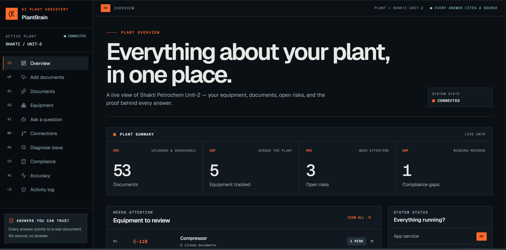

# PlantBrain AI

**The missing memory layer for industrial operations — ask any question about a plant, get an answer stitched from every document, with every claim cited.**

- 🚀 **Live app**: https://plantbrain-production.up.railway.app
- 🔌 **Live API + interactive docs**: https://plantbrain-api-production.up.railway.app/docs
- 📦 **Repo**: https://github.com/MridulNegi2005/PlantBrain

Built for **ET AI Hackathon 2026 — Problem Statement 8 (Industrial Knowledge Intelligence)**.



## What it does

PlantBrain is an asset-first, cited "operations brain" for an industrial plant. Ask a question in plain English and it fuses equipment manuals, work orders, inspection reports, incident logs, and compliance records into a single answer built around the asset you care about. Every claim points back to the exact document and page it came from. If it can't find a supporting source, it refuses to answer — no source, no answer.

## Key features

- **Cited copilot** — every answer carries page-level citations, a confidence score, an explicit list of what evidence is still missing, and recommended next actions. No source → no answer.
- **GraphRAG, not just search** — combines semantic vector search (pgvector) with a real knowledge graph (asset → documents → failure modes → components). The copilot walks multi-hop links to answer questions no single document could.
- **AI agents** — root-cause analysis, compliance-gap detection (catches missing statutory certificates), and similar-past-failure retrieval — all cited.
- **Measured, not vibes** — a built-in evaluation harness scores the system on real questions with known answers.
- **Secure by design** — uploaded documents are treated as untrusted; prompt-injection attempts are detected and the model refuses embedded instructions. Full audit trail.
- **Data sovereignty** — provider-agnostic LLM: runs on Groq's free tier today, or swap to a local on-prem Ollama with a one-line config change so plant data never leaves the premises.

## Proof it works

Measured from an actual evaluation run:

| Metric | Result |
|---|---|
| Retrieval hit-rate (top-5) | 100% |
| Answer faithfulness (RAGAS) | 0.82 |
| Answer relevancy (RAGAS) | 0.91 |
| Context recall (RAGAS) | 0.92 |
| Asset-tag extraction precision / recall | 100% / 100% |
| Avg. answer time vs. manual search | ~3.9s vs ~12 min |

## Tech stack

FastAPI · PostgreSQL + pgvector · fastembed (local bge-small embeddings, no API key) · OpenAI-compatible LLM (Groq / Ollama) · NetworkX knowledge graph · Next.js + Tailwind frontend · deployed on Railway.

## Team

Mridul Negi (backend, ingestion, RAG/graph, AI agents) · Atishay Jain (frontend, product, demo).

---

ET AI Hackathon 2026 — Problem Statement 8 (AI for Industrial Knowledge Intelligence). Full product/build plan:
`docs/plantbrain_ai_statement_8_deep_build_plan.md`. API contract for frontend/backend integration:
[`docs/api-contract.md`](docs/api-contract.md).

## Team & branches
- `negi` (Mridul) — backend, ingestion, RAG/graph, AI agents.
- `aj` (Atishay) — frontend, product, demo.
- `main` — integration branch, merged at defined intervals. Don't push directly to `main`.

## Backend setup
```powershell
cd backend
python -m venv .venv
\.venv\Scripts\Activate.ps1
python -m pip install -r requirements.txt
Copy-Item .env.example .env

# Choose one database mode in .env:
# Local demo: DATABASE_URL=sqlite:///./plantbrain.db
# Production-like: leave DATABASE_URL empty and fill POSTGRES_* (pgvector required)

python -m scripts.db_bootstrap        # creates tables and seeds the demo plant/assets
python -m scripts.load_corpus         # registers the committed synthetic corpus
python -m scripts.ingest_corpus       # extract -> chunk -> retrieval index -> graph
python -m scripts.run_eval            # (optional) run the eval harness, store metrics

python -m uvicorn app.main:app --reload --port 8000
```
No Docker is required. SQLite + BM25 is the zero-config demo path; hosted Postgres + pgvector is the
production-like semantic retrieval path. Visit `http://localhost:8000/docs` for interactive API docs, or
`http://localhost:8000/health` to check DB + pgvector status. On Postgres, embeddings use local fastembed
(bge-small, 384 dimensions); the first embedding call downloads the ONNX model once (~100MB, cached).

The cited copilot uses an **OpenAI-compatible LLM** (Groq free tier by default — set `LLM_API_KEY` in `.env`;
or point `LLM_BASE_URL` at a local Ollama). Without a key it falls back to extractive cited answers.
Embeddings are local/free (fastembed).

Run tests: `python -m pytest tests/ -q` (hermetic in-memory SQLite; never touches the hosted DB).

## Frontend setup
```bash
cd frontend
npm install
cp .env.example .env.local
npm run dev
```
Build against `docs/api-contract.md`. The backend returns persisted evidence and explicit empty/unknown states;
it does not fabricate fixture evidence.

## Status
Integrated prototype: document ingestion, cited retrieval, knowledge graph, RCA/compliance/lessons agents,
evaluation harness, audit/security events, synthetic corpus, and the operations frontend are implemented.
LLM synthesis is optional; without a key, evidence-backed extractive fallbacks remain available.
