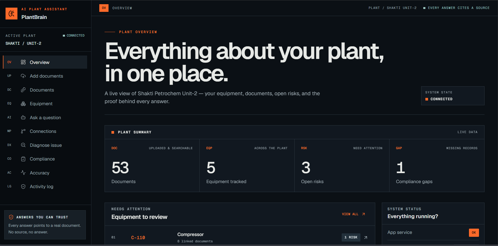

# PlantBrain AI

PlantBrain AI is an asset-first knowledge system for an industrial plant. A user asks a question in
plain English. The system returns one answer that combines equipment manuals, work orders, inspection
reports, incident logs, and compliance records for the relevant asset. Each claim links to the exact
source document and page. If the system finds no supporting source, it does not answer.

The team built PlantBrain for the ET AI Hackathon 2026, Problem Statement 8 (Industrial Knowledge
Intelligence).

- Live application: https://plantbrain.mridulnegi.dev
- Live API and interactive documentation: https://api.mridulnegi.dev/docs



## Features

### Cited copilot
- Every answer includes page-level citations, a confidence score, a list of missing evidence, and
  recommended next actions.
- The copilot answers only from retrieved sources. Without a source, it does not answer.

### GraphRAG retrieval
- The system combines semantic vector search (pgvector) with a knowledge graph.
- The graph links each asset to its documents, failure modes, and components.
- The copilot follows multi-hop links to answer questions that no single document covers.

### AI agents
- A root-cause analysis agent explains an asset failure from past evidence.
- A compliance-gap agent detects missing statutory certificates.
- A similar-failure agent retrieves comparable past incidents.
- Every agent output includes citations.

### Evaluation
- A built-in evaluation harness scores the system on known questions with known answers.

### Security
- The system treats every uploaded document as untrusted data.
- It detects prompt-injection attempts and refuses embedded instructions.
- It records a full audit trail.

### Provider-agnostic model
- The copilot uses an OpenAI-compatible LLM. It runs on the Groq free tier by default.
- A one-line configuration change points the system at a local Ollama model, so plant data stays
  on-premises.
- Embeddings run locally with fastembed (bge-small). The embeddings need no API key.

## Evaluation results

The team measured these results from an evaluation run.

| Metric | Result |
|---|---|
| Retrieval hit-rate (top-5) | 100% |
| Answer faithfulness (RAGAS) | 0.82 |
| Answer relevancy (RAGAS) | 0.91 |
| Context recall (RAGAS) | 0.92 |
| Asset-tag extraction precision / recall | 100% / 100% |
| Average answer time against manual search | about 3.9 s against about 12 min |

## Technology
- FastAPI
- PostgreSQL with pgvector
- fastembed (local bge-small embeddings)
- OpenAI-compatible LLM (Groq or Ollama)
- NetworkX knowledge graph
- Next.js with Tailwind CSS frontend
- Cloudflare Workers frontend and Oracle Cloud VM backend

## Team
- Mridul Negi — backend, ingestion, RAG and graph, AI agents.
- Atishay Jain — frontend, product, and demo.

## Installation

### Backend
1. Create the environment and install the dependencies.
   ```powershell
   cd backend
   python -m venv .venv
   .venv\Scripts\Activate.ps1
   python -m pip install -r requirements.txt
   Copy-Item .env.example .env
   ```
2. Select a database mode in `.env`.
   - Local demo: set `DATABASE_URL=sqlite:///./plantbrain.db`.
   - Production mode: leave `DATABASE_URL` empty and set the `POSTGRES_*` values. pgvector is required.
3. Prepare the data and start the server.
   ```powershell
   python -m scripts.db_bootstrap
   python -m scripts.load_corpus
   python -m scripts.ingest_corpus
   python -m uvicorn app.main:app --reload --port 8000
   ```
   The interactive documentation is at `http://localhost:8000/docs`.

### Frontend
1. Install the dependencies and start the development server.
   ```bash
   cd frontend
   npm install
   cp .env.example .env.local
   npm run dev
   ```
