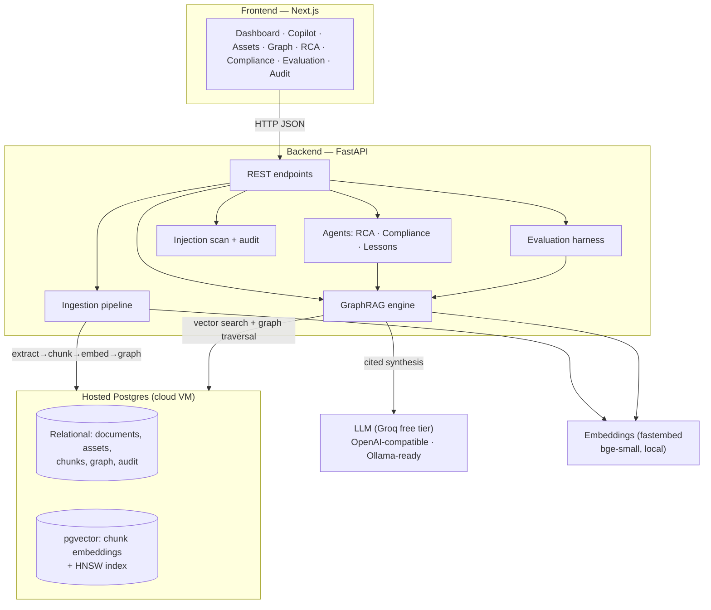

# PlantBrain AI — Architecture

PlantBrain turns a plant's scattered documents into a single, queryable, cited
"operations brain." Documents are pre-processed once into meaning-vectors **and** a
knowledge graph; questions are answered in real time by fusing both.

## System diagram

## Two-phase data flow

**Ingestion (server-side, once per document)**
`Document → extract (PyMuPDF) → chunk (page-aware, overlap) → embed (fastembed, 384-d)
→ store in pgvector → build knowledge graph (assets/failures/components + provenance)`

**Query (real time)**
`Question → embed → pgvector similarity + graph expansion (shared failure modes)
→ no-source-no-answer guardrail → LLM cited synthesis → answer + citations + graph path
+ confidence + missing evidence + next actions`

## Components

| Layer | Component | Tech / notes |
|---|---|---|
| Frontend | Next.js + Tailwind + shadcn/ui | Dashboard, copilot chat, graph viewer, evidence drawer |
| API | FastAPI | REST; background tasks for ingestion + evaluation |
| Ingestion | `app/ingestion/*` | PyMuPDF text+tables, pandas CSV/XLSX, optional OCR, chunker, embeddings |
| Retrieval | `app/rag/retriever.py` | pgvector cosine search fused with NetworkX graph traversal |
| Knowledge graph | `app/graph/*` | Rule-based, deterministic; Asset/Document/FailureMode/Component (ISO-15926 flavour), provenance on every edge |
| LLM | `app/llm/client.py` | OpenAI-compatible; Groq default, swap to local Ollama via env only |
| Agents | `app/agents/*` | RCA, compliance-gap, lessons — same guardrailed engine |
| Evaluation | `app/evaluation/harness.py` | Retrieval/citation/RAGAS-style/entity/compliance metrics from real runs |
| Security | `app/security/injection.py` | Prompt-injection scan → SecurityEvent; audit log on actions |
| Storage | PostgreSQL + pgvector | Relational + vectors in one DB (self-hosted on a cloud VM) |

## Why this design
- **One datastore (Postgres + pgvector)** holds relational data *and* embeddings — simpler
  than bolting on a separate vector DB, and a genuine production topology.
- **Deterministic knowledge graph** — no hallucinated edges; the LLM is used only for
  language (answer synthesis), never for structural facts.
- **Provider-agnostic LLM** — free Groq now, private on-prem Ollama for confidential plant
  data later, with zero code change (only `LLM_BASE_URL` / `LLM_MODEL`).
- **Guardrails first** — no-source-no-answer, prompt-injection scanning, bounded citations,
  full audit trail.

## Production roadmap (shown, not built for the demo)
SSO/RBAC, rate limiting, connectors (SAP PM / Maximo / SharePoint), on-prem LLM, and
network hardening of the hosted Postgres.
